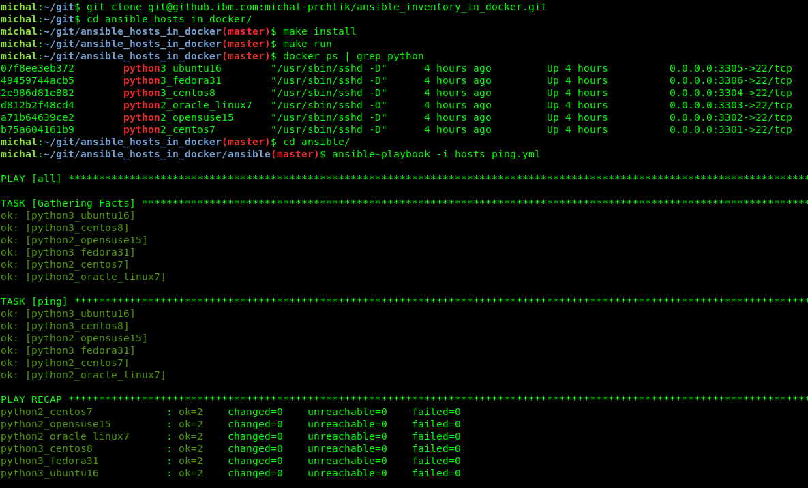

# Ansible hosts in containers

Project contains 6 container images with `different linux distributions` with preconfigured users, SSH accesses and ansible connection. The purpose is faster development of `ansible playbooks` in your local environment (e.g. laptop). You can also use it as a local environment for learning `ansible`. 

You can use containers with configured `ansible inventory` (ansible hosts) few minutes after: 

```
git@github.com:michalprchlik/ansible_hosts_in_containers.git
cd ansible_hosts_in_containers
make install
make run
podman ps | grep python
cd ansible
ansible-playbook -i hosts ping.yml
```



# Overview

- different linux OS running in containers
- python 2 + python 3 is supported
- configured `ansible/hosts` file with connections to containers
- in all containers the user `user` is created with public part of SSH key `container/id_rsa.pub` in it's home directory 
- ansible is configured to use private part of SSH key `ansible/id_rsa` in `ansible/hosts` file
- no additional authentication setup is needed!
- `user` is set up in `/etc/sudoers` so he can use `sudo` command
- example ansible playbook `ansible/ping.yml` with ping to all hosts
- all containers are connected to network `ansible`
- total size of images is ~2GB 

Supported linux OS in containers:
- `CentOS 7`
- `CentOS 8`
- `Fedora 31`
- `Ubuntu 16`
- `Oracle linux 7`
- `openSUSE 15`

# Installation & Operation

See `Makefile` for available jobs.

Build up all container images. It will take ~5 minutes on fresh system

```
make install
```

Start all containers. It will also remove previously created containers (your changes in containers will be lost)

```
make run
```

Check `status` of containers created by this project, as well as their `names` and `ports`

```
podman ps | grep python
```

To get inside of container `python2_centos7` running on port `3301` (or any other container) you can use 2 approaches below. `make run` will reset containers to default state

```
# standard ssh connection to container to "user"
ssh user@localhost -p 3301 -i ansible/id_rsa

# open bash command in container to root user
podman exec -it python2_centos7 bash
```

Remove all container images and containers

```
make remove
```

# Ansible commands 

All commands are prepared to be executed from `ansible` directory

Run example playbook which will ping all hosts

```
cd ansible
ansible-playbook -i hosts ping.yml
```

Run `ad hoc` commands to ansible hosts

```
cd ansible

# ping all hosts
ansible all -i hosts -m ping

# ping only containers with centos linux
ansible centos -i hosts -m ping
```

# Useful tips

1/
You can copy `ansible` directory to your project and develop the `playbooks` there. Required files: 
- `ansible.cfg`
- `id_rsa`
- `hosts`

2/
You can remove any host from `ansible/hosts`. Defaults will still be part of this repository

3/
You can run multiple containers with same OS on different ports (e.g. 10x ubuntu16). Check `Makefile` for `podman run` commands. Copy commands and change `name` and `port` for each new container. Update `ansible/hosts` file with new containers info

# Directory structure

```
ansible/
  ansible.cfg       - configuration file, which is automatically loaded when executing ansible commands from this directory
                      the file is required only because rebuilding containers breaks ~/.ssh/known_hosts fingerprints (new container=new fingerprint)
  id_rsa            - private part of SSH key used by ansible, the key filename is defined in "hosts" file
  hosts             - list of all ansible inventory hosts (running containers)
                      you can edit the file to change hosts or copy any row to another hosts/inventory file
  ping.yml          - example playbook. Ping to all hosts
container/
  *.containerfile   - various containerfiles for building container images
  id_rsa.pub        - public part of SSH key, the file is copied to containers during installation (make install)
image.png
Makefile            - orchestration for the project
README.md
```
